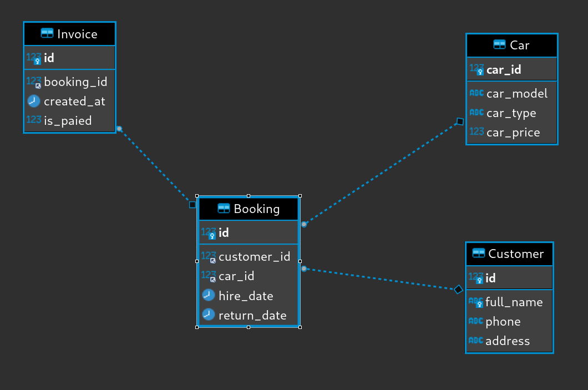
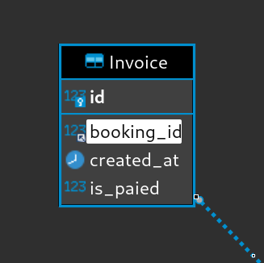
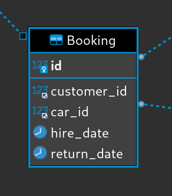
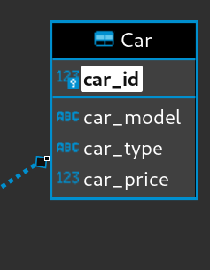
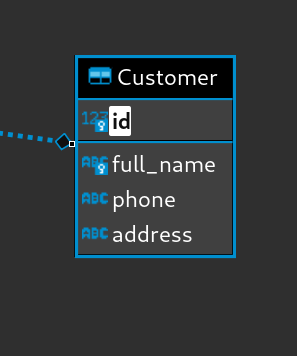
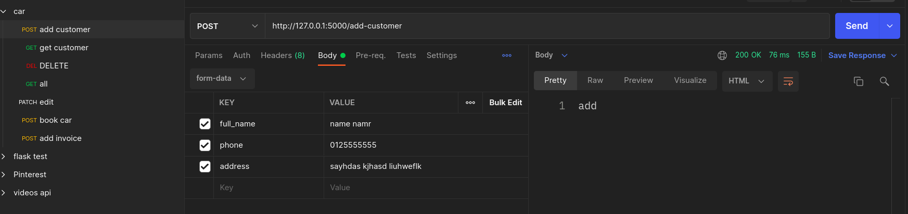
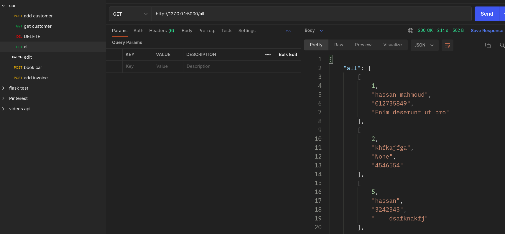
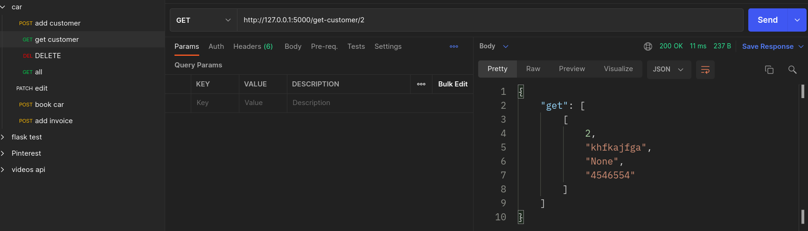
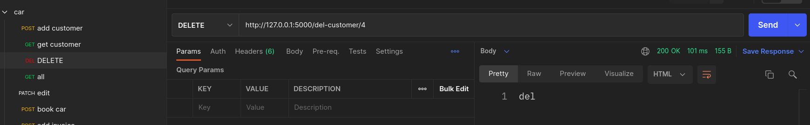
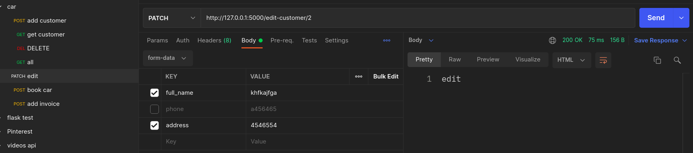

  <h1> 🚘 Car Hire System 🚘 </h1>

## FULL ERD

### Invoice

>    CREATE TABLE Invoice (id int PRIMARY KEY, booking_id int , created_at date , is_paied BOOLEAN, FOREIGN KEY (booking_id) REFERENCES Booking (id) )

### Booking

> CREATE TABLE Booking (id int PRIMARY KEY AUTO_INCREMENT, customer_id int , car_id int, hier_date date, return_date date, FOREIGN KEY (customer_id) REFERENCES Customer (id), FOREIGN KEY (car_id) REFERENCES Car (car_id) );

### Car

>CREATE TABLE Car (car_id int PRIMARY key AUTO_INCREMENT , car_model varchar(30) NOT null, car_type ENUM('samll','family','van') not null , car_price FLOAT not null )

### Customer

> CREATE TABLE Customer (id int PRIMARY key AUTO_INCREMENT, full_name varchar(255) not null UNIQUE, phone varchar(255) , address varchar(255))

---------------------------------------------------------
# Postman result

> add customer

> get all customer

> get one customer

> delete customer

> edit customer data

Thank you

